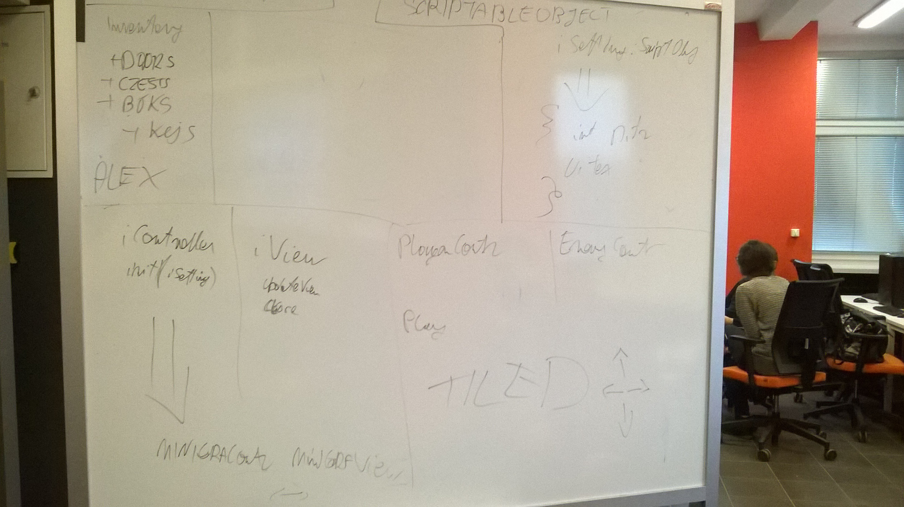

# Architektura
**Praktyka Zespołowego Tworzenia Gier Komputerowych**  
**Politechnika Śląska, AEiI, Informatyka**  

**Prowadzący:** dr inż Michał Kawulok

**Sekcja:** 1  
**Kierownik sekcji:** Adam Nosal  

**Skład sekcji:**  
Aleksander Biela  
Rafał Dziuryk  
Arkadiusz Jagiełka  
Marek Lubas  
Wojciech Moska   
Adam Nosal   
Bartłomiej Szary   
Bartosz Śliwa  

### Wstęp
Zdecydowaliśmy się stworzyć grę w środowisku Unity, co pomimo wielu udogodnień wymusza na nas stosowanie pewnych konwencji.

Katalog **Assets** podzieliliśmy na:  
* **Editor**,
* **Fonts**,
* **Graphics**,
* **Prefabs**,
* **Scenes**,
* **Scripts**,
* **Standard Assess**.

Katalog **Scripts** został podzielony na:
* **Framework**, gdzie znajdują się głównie interfejsy i podstawowe struktury,
* **MiniGameData**, z danymi poszczególnych gier
* katalogi każdej minigry.

### Diagram klas

Przygotowany został diagram klas, który prezentuje zależności między klasami i interfejsami składającymi się na jedną z minigier logicznych. Przedstawione zostały zależności naszych klas od klas silnika Unity. Szczegółowo wypisaliśmy pola oraz funkcje, co pozwala przewidzieć odpowiedzialność każdej z klas.

### Diagram sekwencji

Przygotowaliśmy również diagram sekwencji, dzięki któremu można zaobserwować interakcje między komponentami systemu. Diagram został stworzony dla sytuacji, gdy gracz wciśnie przycisk **Play**. Można zauważyć wzorzec kontroler-widok, rozszerzony o klasę **PuzzleDisplay**, która wykonuje samą logikę inicjalizacji i mieszania puzzli, przekazując zarządzanie pojedyńczym puzzlem do klasy **PuzzleTile**.

Poniższe zdjęcie prezentuje wynik naszych zajęć projektowych:

