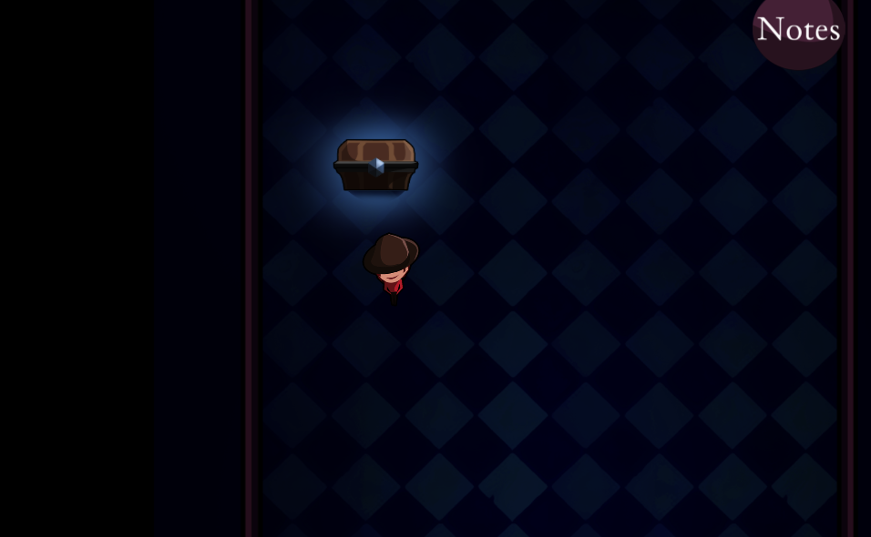
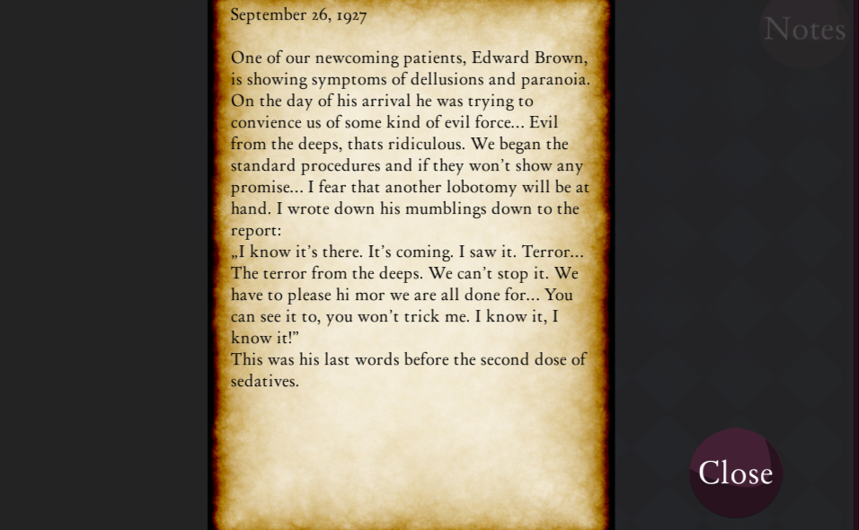
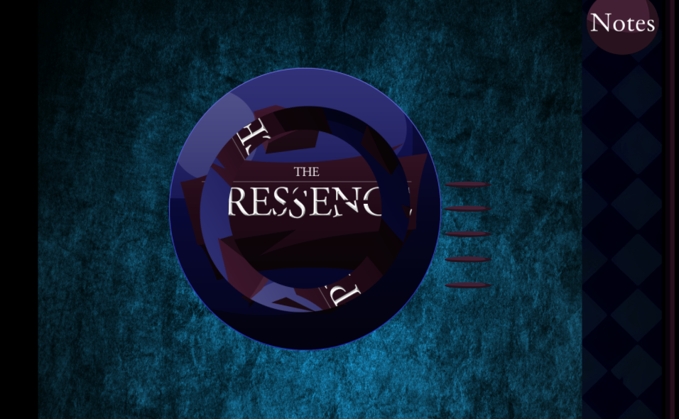

## Raport końcowy
**Praktyka Zespołowego Tworzenia Gier Komputerowych**  
**Politechnika Śląska, AEiI, Informatyka**  

**Prowadzący:** dr inż. Michał Kawulok

**Sekcja:** 1  
**Kierownik sekcji:** Adam Nosal  

**Skład sekcji:**  
Aleksander Biela  
Rafał Dziuryk  
Arkadiusz Jagiełka  
Paweł Kura  
Marek Lubas  
Wojciech Moska   
Adam Nosal   
Bartłomiej Szary   
Bartosz Śliwa  

### Podsumowanie prac
Zadaniem naszej sekcji było stworzenie stworzenie gry opierającej się na systemie minigier logicznych, do których gracz zostanie przekierowany, jeśli znajdzie się w odpowiednim miejscu na planszy. Możemy napisać, że udało się spełnić wszystkie założenia funkcjonalne, gracz potrafi: poruszać się po planszy, unikać przeciwników, rozwiązywać minigry, pokonywać przeszkody na planszy oraz korzystać z zadań na różnym poziomie trudności.

Udało się spełnić również wymagania niefunkcjonalne dotyczące grafiki i sterowania. Sam styl graficzny został utrzymany w mrocznej konwencji, czyli tak, jak planowaliśmy od początku.

Na screenie widać jeden z poziomów, po których może poruszać się bohater. Widać skrzynię, z którą interakcja pozwala na przejście do minigry logicznej:

Po kliknięciu w przycisk "Notes" możemy przeczytać klimatyczny opis dotyczący fabuły:

Podejście do skrzyni przenosi nas do gry logicznej, gdzie gracz musi przekręcić wszystkie obręcze tak, by przedstawiały właściwy obrazek:

### Metodyka pracy
Nie da się ukryć, że nasz zespół posiada wystarczające umiejętności programistyczne, dlatego głównym wyzwaniem w projekcie było zorganizowanie pracy zespołowej. Do codziennej komunikacji korzystaliśmy z Facebooka, gdzie na grupie wymienialiśmy się drobnymi uwagami czy pomysłami, jest to oczywiście naturalne, bo każdy z nas codzinnie wchodzi na Facebooka. Do sformalizowania zadań wykorzystywaliśmy Trello, gdzie mogliśmy łatwo śledzić postępy w projekcie oraz terminy, chociaż trzeba przyznać, że nie wykorzystaliśmy w pełni możliwości tego narzędzia. Do komunikacji z "klientem" służyła platforma Moodle, która była naszą bazą terminów i wymagań. Naszym systemem kontroli wersji był Git w serwisie GitHub, gdzie przechowywaliśmy repozytorium oraz informowaliśmy o błędach w projekcie (zakładka Issues). Każda minigra była tworzona na osobnym branchu, który po zakończeniu pracy został mergowany do mastera przez kierownika zespołu. Grafiki i dokumentacja były wrzucane z przedrostkami [Graphics] i [Documentation].

### Wnioski
* system kontroli wersji pozwala zapanować nad pracą grupową,  
* na każde zadanie przeznacza się więcej czasu niż się początkowo planowało,  
* nie powinno zostawiać się zadań na ostatnią chwilę.
