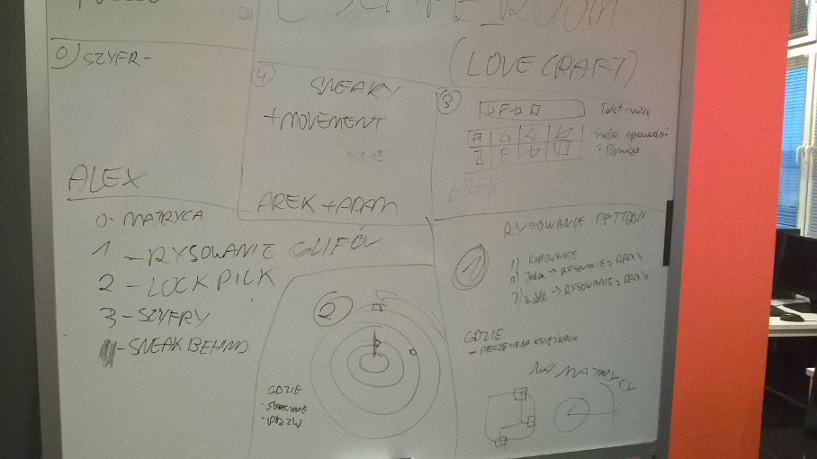

# Wymagania - zadanie 2
**Praktyka Zespołowego Tworzenia Gier Komputerowych**  
**Politechnika Śląska, AEiI, Informatyka**  

**Prowadzący:** dr inż Michał Kawulok

**Sekcja:** 1  
**Kierownik sekcji:** Adam Nosal  

**Skład sekcji:**  
Aleksander Biela  
Rafał Dziuryk  
Arkadiusz Jagiełka  
Paweł Kura   
Marek Lubas  
Wojciech Moska   
Adam Nosal   
Bartłomiej Szary   
Bartosz Śliwa  

**Rodzaj oraz temat gry:**  
Na poprzednich zajęciach projektowych ustaliliśmy, że zamierzamy stworzyć grę z gatunku "room escape", czyli de facto połączenie: przygodówki, skradanki oraz gry logicznej z elementami zręcznościowymi. Grę zamierzamy umieścić w świecie przypominającym twórczość H.P. Lovecrafta.

**Zakres prac:**  
Nasz projekt zamierzamy oprzeć na systemie minigier - gracz może poruszać się po planszy, a po natrafieniu na przeszkodę zostaje przekierowany do gry logicznej, której rozwiązanie pozwoli zneutralizować ową przeszkodę. Rozgrywkę będziemy widzieć w grafice 2D, z lotu ptaka, z kolei zagadki logiczne zostaną przedstawione en face.  

Efekty naszych prac są widoczne na zdjęciu:

**Wstępne wymagania:**  

1. Wymagania funkcjonalne:
  * poruszanie się postacią po planszy,
  * unikanie przeciwników sterowanych przez komputer,
  * rozwiązywanie minigier,
  * ukończenie minigry pozwala graczowi na przejście danej przeszkody,
  * występowanie kilku poziomów (plansz), z którymi wzrasta poziom trudności.
2. Wymagania niefunkcjonalne:
  * grafika 2D,
  * sterowanie dotykiem,
  * wykorzystanie silnika Unity,
  * możliwość uruchomienia na platformie Android.
